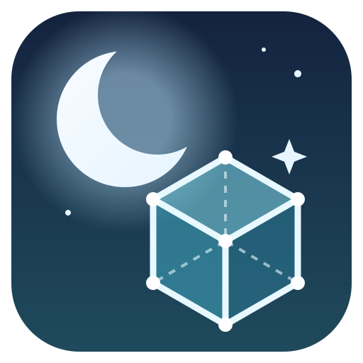
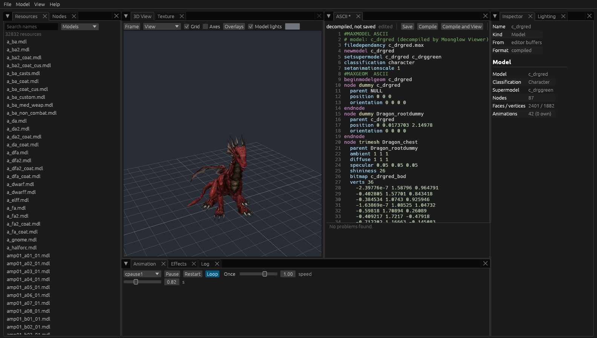
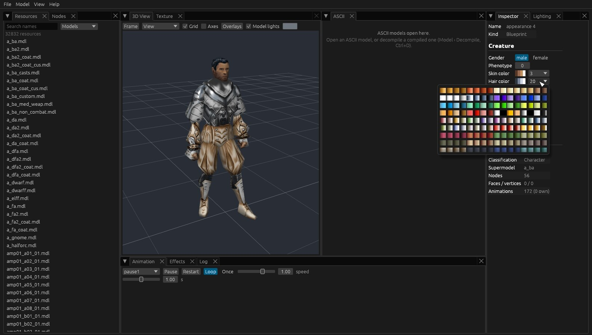
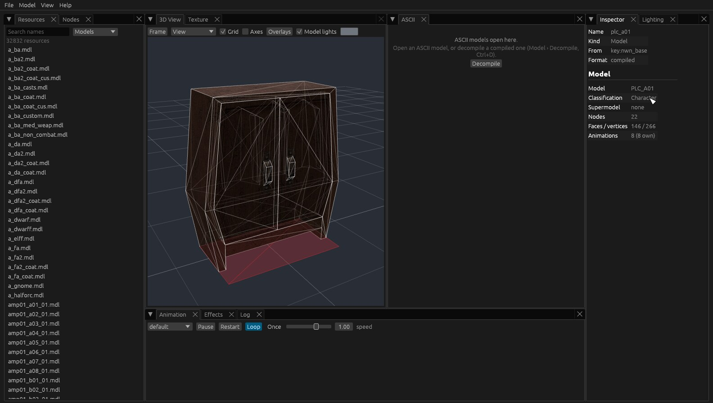
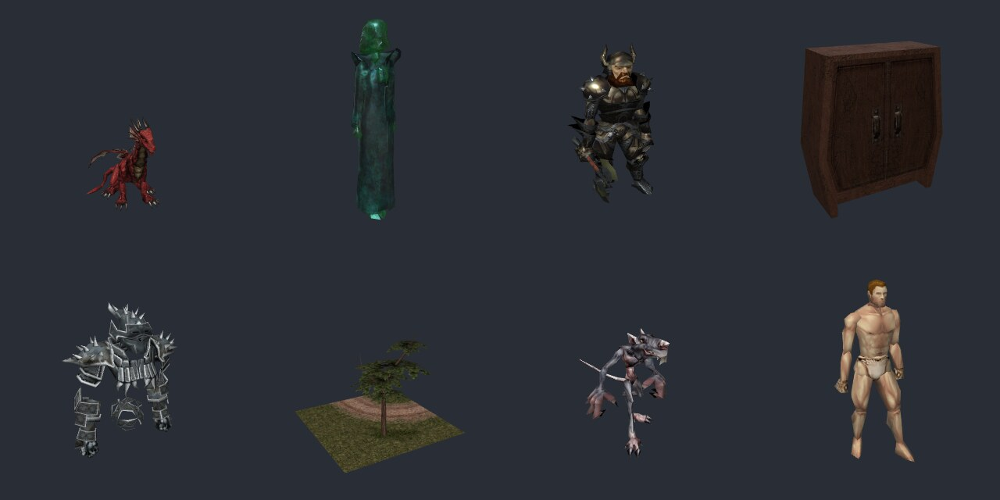

<p align="center">
  
</p>

<h1 align="center">Moonglow Viewer</h1>

<p align="center">
  A model viewer for <strong>Neverwinter Nights: Enhanced Edition</strong>.<br>
  Everything the game draws, lit as the game lights it, on Linux, Windows and macOS.
</p>

<p align="center">
  <a href="https://github.com/jadzziaa/moonglow-viewer/releases/latest"></a>
  <a href="https://github.com/jadzziaa/moonglow-viewer/actions/workflows/ci.yml"></a>
  <a href="LICENSE"></a>
  
</p>

<p align="center">
  <a href="https://github.com/jadzziaa/moonglow-viewer/releases/latest"><strong>Download</strong></a> ·
  <a href="docs/manual/README.md"><strong>User manual</strong></a> ·
  <a href="docs/manual/05-command-line.md"><strong>Command line</strong></a>
</p>



## What it is

Moonglow Viewer opens the visual files of Neverwinter Nights: Enhanced
Edition and shows them as the game would. It is a sibling of
[Moonglow Toolset](https://github.com/jadzziaa/moonglow-toolset) and draws
with its renderer, written in Rust with an
[egui](https://github.com/emilk/egui) interface and a
[wgpu](https://wgpu.rs) renderer.
- **It shows what the game shows.** The renderer is matched to the game
  client: its lighting, fog, materials, emitters and visual effects are
  checked against the client's own pictures.
- **It reads what the game reads**, the way the game finds it: the game's
  load order, your override, haks, modules and loose folders.
- **It runs natively** on Linux, Windows and macOS, with a window and
  without one.

Moonglow Viewer contains no game data. It reads the game's files from your
installation, so you need Neverwinter Nights: Enhanced Edition.

## What it does

- **Every visual file the game uses:** models (compiled and ASCII),
  walkmeshes, TGA, DDS and PLT textures with their TXI, MTR materials,
  tilesets, blueprints (creatures, items, placeables, doors) and creatures
  by `appearance.2da` row, with their look and PLT colors to change.
- **The game's lighting:** a studio light, the area wizard's
  `environment.2da` presets by day or night, or an area's own settings;
  emitters running, and `visualeffects.2da` effects on the hooks the game
  uses.
- **Decompile and compile in one click:** a native decompiler (all 25,597
  compiled models of the game read back the same), nwnmdlcomp, and the
  game's own model compiler.
- **An ASCII editor with hot reload:** the view follows every edit and
  every change other programs make to the file; problems are marked by
  line; the cursor and the selected node stay in step.
- **Overlays and picking:** walkmesh faces by surface material, wireframe,
  normals and the skeleton, drawn in 3D; click to select a node.

<table>
  <tr>
    <td width="50%"></td>
    <td width="50%"></td>
  </tr>
  <tr>
    <td align="center">Creatures by appearance, colored from the game's palettes</td>
    <td align="center">Wireframe and walkmesh overlays</td>
  </tr>
</table>

## Without a window

Every package includes `mgv`, the command line, for build pipelines,
scripts and catalogues. It needs a graphics card for pictures, but no
display, and the same command gives the same bytes.

```sh
mgv render plc_a01 -o chest.png --size 1024x1024 --view front
mgv render appearance:6 --vfx 4 --light env:0:night -o warded.png
mgv turntable c_golemerald --frames 48 -o golem.png      # an animated PNG
mgv gallery "c_*" -o creatures/ --size 256x256           # index.html and manifest.json
mgv info c_wererat                                        # JSON
mgv decompile c_golemerald -o ascii/
mgv lint mymodel.mdl --notes
```

A gallery redraws only what changed since it last ran. See
[The command line](docs/manual/05-command-line.md).



## Download

Packages for each system are on the
[releases page](https://github.com/jadzziaa/moonglow-viewer/releases/latest):

| System | Package |
| --- | --- |
| Linux (x86-64) | `MoonglowViewer-<version>-x86_64.AppImage`: make it executable and run it (glibc 2.35 or newer). Started through a link named `mgv`, it is the command line |
| Windows 10 and 11 | `MoonglowViewer-<version>-windows-x64-setup.exe` |
| macOS 11 and later | `MoonglowViewer-<version>-macos.dmg` |

Moonglow Viewer finds the game where Steam installs it; otherwise choose
its folder with File › Game Folder…. The packages aren't signed yet:
Windows' SmartScreen and macOS' Gatekeeper ask before the first run.

## Documentation

- [User manual](docs/manual/README.md), also in the app under Help › User
  Manual (F1).
- [The plan](docs/PLAN.md): goals, architecture, phases, testing and
  licensing.
- [Packaging](packaging/README.md): building the AppImage, Flatpak, Windows
  installer and macOS app.

## Building from source

You need a stable Rust toolchain (1.98 or newer; `rust-toolchain.toml`
selects it with rustup). The Moonglow Toolset crates are fetched from
[their repository](https://github.com/jadzziaa/moonglow-toolset) at a
release tag (`Cargo.toml`; the commit in `Cargo.lock`).

```sh
cargo run --release -p moonglow-viewer          # the window
cargo run --release -p mgv -- --help            # the command line
```

## Testing

```sh
cargo test --workspace --release                # corpus and GPU tests skip without a game or GPU
cargo clippy --workspace --all-targets          # must be warning-free
cargo fmt                                       # rustfmt.toml: width 100
```

Tests run at the lowest tier that catches their regressions: unit tests;
corpus tests over the installed game (every compiled model decompiles and
reads back the same; every visual effect applies); differential tests
against nwnmdlcomp; offscreen renders; and the window's flows driven
through `egui_kittest`.

## Layout

A Cargo workspace on Moonglow Toolset's crates (the game's file formats,
its load order, the renderer), layered bottom-up:

| Folder | What |
| --- | --- |
| `crates/mgv-mdl` | the external compile and decompile back ends (nwnmdlcomp, the game's compiler); the native compiler and decompiler are the toolset's `mg-mdl` |
| `crates/mgv-library` | layers over the game's load order, editor buffers, file watching, the model cache |
| `crates/mgv-stage` | actors, animation, particles, lights, lighting rigs, the camera, overlays, offscreen rendering |
| `crates/mgv-gallery` | batch rendering: thumbnails, the HTML index, the manifest |
| `crates/mgv-ui` | the egui application |
| `apps/moonglow-viewer`, `apps/mgv` | the window and the command line |
| `packaging/` | release packages |

## License

Moonglow Viewer is free software under the
[GNU General Public License, version 3](LICENSE). It includes the Ubuntu
Bold font (Ubuntu Font Licence 1.0). Game assets, including Beamdog's
shaders, are only read from your installation, never distributed. The
screenshots show the game's own models as Moonglow Viewer draws them.

Neverwinter Nights is a trademark of its owners. Moonglow Viewer is not
affiliated with Beamdog or Wizards of the Coast.
